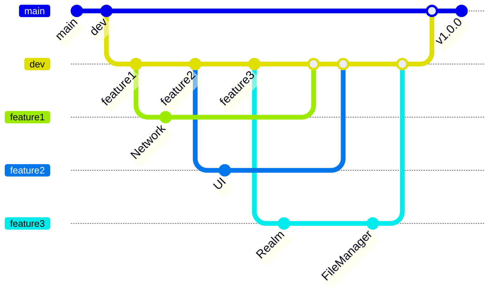

# 🎥 스크린타임 

## 🧑🏻‍💻 팀원 소개
|||
| :---: | :---: | :---: |
| 김상규 | 양승혜 | 최대성 |

## 프로젝트 소개

- 당신의 스크린 타임을 지배했던 영화를 한 눈에
- 주간 미디어 컨텐츠 순위를 살펴보고, 궁금했던 영화를 검색, 즐겨찾기 기능을 통해 

## 🙋‍♀️ 프로젝트  주요기능  
- 인기 영화, TV 시리즈를 함께 볼 수 있는 메인화면
- 원하는 컨텐츠를 검색할 수 있는 검색화면
- 좋아요한 컨텐츠를 볼 수 있는 즐겨찾기 화면
- Youtube와 연동되어 제공되는 **영화 예고편**
- 컨텐츠 세부 정보를 제공하고 비슷한 컨텐츠를 추천해주는  상세화면

## 🛠 개발 환경  

- 개발 인원: iOS개발 3명
- 개발 기간: 24.10.08 - 24.10.13(6일)
- iOS 최소 버전: 15.0+
   

##  기술 스택
- UI: UIKit, Snapkit, YoutubePlayerKit, Kingfisher, IQKeyboardManager
- Reactive: RxSwift, RxCocoa, RxDataSource
- Database: FileManager, Realm
- Network: Alamofire
- 아키텍쳐 및 디자인 패턴: MVVM(Input - Output), Repository﹒Router﹒Singleton 패턴
- 형상 관리 도구: Git

## Git Commit Message Convention
🐞 Fix: 올바르지 않은 동작(버그)을 고친 경우 

🐣 Feat: 새로운 기능을 추가한 경우 

✨ Add: feat 이외의 부수적인 코드, 라이브러리 등을 추가한 경우, 새로운 파일(Component나 Activity 등)을 생성한 경우도 포함 

🩹 Refactor: 내부 로직은 변경하지 않고 기존의 코드를 개선한 경우, 클래스명 수정&가독성을 위해 변수명을 변경한 경우도 포함

 🗑️ Remove: 코드, 파일을 삭제한 경우, 필요 없는 주석 삭제도 포함 

🚚 Move: fix, refactor 등과 관계 없이 코드, 파일 등의 위치를 이동하는 작업만 수행한 경우 

🎨 Style: 내부 로직은 변경하지 않고 코드 스타일, 포맷 등을 수정한 경우, 줄 바꿈, 누락된 세미콜론 추가 등의 작업도 포함 

💄 Design: CSS 등 사용자 UI 디자인을 추가, 수정한 경우 

📝 Comment: 필요한 주석을 추가, 수정한 경우(❗ 필요 없는 주석을 삭제한 경우는 remove) 

📚 Docs: 문서를 추가, 수정한 경우 

🔧 Test: 테스트 코드를 추가, 수정, 삭제한 경우 

🎸 Chore: 위 경우에 포함되지 않는 기타 변경 사항 

🙈 gitignore: ignore파일 추가 및 수정

