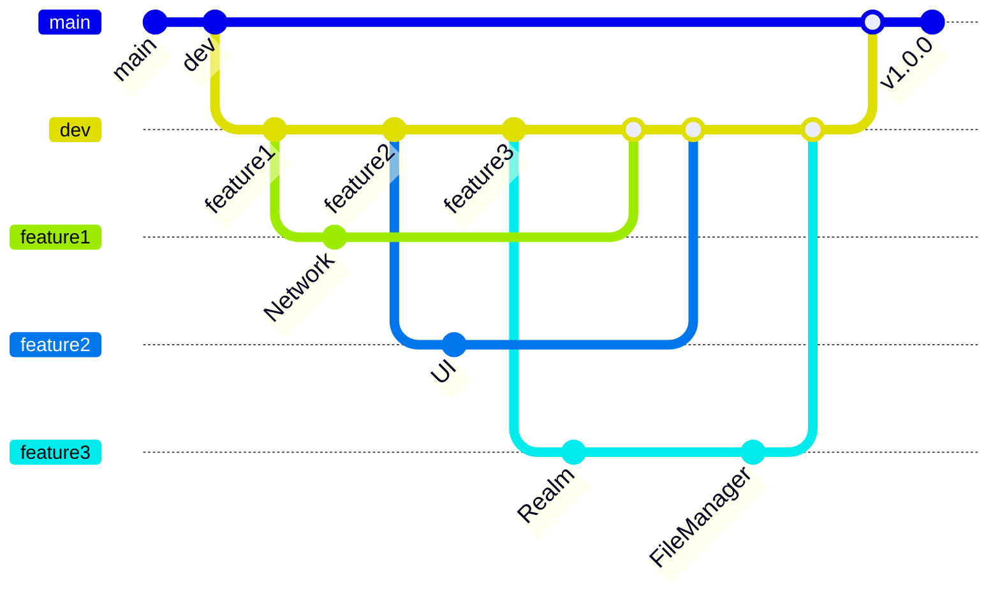

# 🎥 스크린타임 

## 🧑🏻‍💻 팀원 소개
|||
| :---: | :---: | :---: |
| 김상규 | 양승혜 | 최대성 |

 

## 프로젝트 소개

- 당신의 스크린 타임을 지배했던 영화를 한 눈에
- 주간 미디어 컨텐츠 순위를 살펴보고, 궁금했던 영화를 검색, 즐겨찾기 기능을 통해 

 

## 🙋‍♀️ 프로젝트  주요기능  
- 인기 영화, TV 시리즈를 함께 볼 수 있는 메인화면
- 원하는 컨텐츠를 검색할 수 있는 검색화면
- 좋아요한 컨텐츠를 볼 수 있는 즐겨찾기 화면
- Youtube와 연동되어 제공되는 **영화 예고편**
- 컨텐츠 세부 정보를 제공하고 비슷한 컨텐츠를 추천해주는  상세화면

 

## 🛠 개발 환경  

- 개발 인원: iOS개발 3명
- 개발 기간: 24.10.08 - 24.10.13(6일)
- iOS 최소 버전: 15.0+

    

##  기술 스택
- UI: UIKit, Snapkit, YoutubePlayerKit, Kingfisher, IQKeyboardManager
- Reactive: RxSwift, RxCocoa, RxDataSource
- Database: FileManager, Realm
- Network: Alamofire
- 아키텍쳐 및 디자인 패턴: MVVM(Input - Output), Repository﹒Router﹒Singleton 패턴
- 형상 관리 도구: Git

 

## Git Commit Message Convention
🐞 Fix: 올바르지 않은 동작(버그)을 고친 경우 

🐣 Feat: 새로운 기능을 추가한 경우 

✨ Add: feat 이외의 부수적인 코드, 라이브러리 등을 추가한 경우, 새로운 파일(Component나 Activity 등)을 생성한 경우도 포함 

🩹 Refactor: 내부 로직은 변경하지 않고 기존의 코드를 개선한 경우, 클래스명 수정&가독성을 위해 변수명을 변경한 경우도 포함

 🗑️ Remove: 코드, 파일을 삭제한 경우, 필요 없는 주석 삭제도 포함 

🚚 Move: fix, refactor 등과 관계 없이 코드, 파일 등의 위치를 이동하는 작업만 수행한 경우 

🎨 Style: 내부 로직은 변경하지 않고 코드 스타일, 포맷 등을 수정한 경우, 줄 바꿈, 누락된 세미콜론 추가 등의 작업도 포함 

💄 Design: CSS 등 사용자 UI 디자인을 추가, 수정한 경우 

📝 Comment: 필요한 주석을 추가, 수정한 경우(❗ 필요 없는 주석을 삭제한 경우는 remove) 

📚 Docs: 문서를 추가, 수정한 경우 

🔧 Test: 테스트 코드를 추가, 수정, 삭제한 경우 

🎸 Chore: 위 경우에 포함되지 않는 기타 변경 사항 

🙈 gitignore: ignore파일 추가 및 수정

 

 

## 주요 기술

- MVVM 패턴을 활용하여 비즈니스 로직과 UI로직 분리하여 관리, Input/Output을 통해 데이터의 흐름을 명확하게 구현
- Alamofire URLRequestConvertible을 채택한 enum으로 각 endpoint를 case로 구분하고, path, parameters, headers 등의 프로퍼티를 활용해 요청을 간편하고 일관성 있게 구성
- NetworkManager에서 제네릭 타입을 활용해 TMDB API의 다양한 엔드포인트 응답을 단일 메서드로 파싱하여, 모델별 중복 코드를 제거하고 재사용성과 유지보수성을 향상
- UICollectionView에 여러 섹션에 대응할 수 있도록 RxDataSource의 SectionModelType 활용
- Realm을 활용하여 데이터 저장, 이미지 저장을 위해 FileManager 활용
- 상태 변경을 다른 객체에 알리기 위해 NotificationCenter 활용
- BaseViewModel 프로토콜을 통한 ViewModel 구조 표준화로 일관된 개발 패턴 유지
- 네트워크 비동기 요청 결과를 단일 성공 또는 실패 이벤트로 처리하여, API 응답을 효율적으로 관리

 

## 트러블 슈팅 

### 문제 상황

- 초기 View가 init될 때 데이터를 받아오지 않는 문제가 발생.
- combineLatest를 사용했으나, 이 연산자는 모든 Observable에서 값이 발행될 때까지 대기하므로 초기 데이터가 누락

`
  NotificationCenter.default.addObserver(self, selector: #selector(handleNewMediaNotification), name: NSNotification.Name(rawValue: "newmedia"), object: nil)
        
        let savedList = BehaviorSubject(value: [Save(mediaId: 0, title: "")])
        
        
        Observable.merge(input.trigger, triggerSubject)
            .bind(with: self) { owner, _ in
                let list = owner.realmRepo.fetchSavedList()
                savedList.onNext(list)
            }
            .disposed(by: disposeBag)
        
        
        input.deleteSavedContent
            .bind(with: self) { owner, indexPath in
                owner.deleteSavedContent(at: indexPath, from: savedList)
            }
            .disposed(by: disposeBag)
            `

## 원인분석

- combineLatest는 두 개 이상의 Observable의 마지막 값을 조합하여 새로운 값을 방출
- 각 Observable이 적어도 한 번 값을 발행해야 결합된 결과를 얻고 View가 초기화될 때  NotificationCenter로 전달해 주는 값이 없기 때문에 데이터가 방출되지 않음.

## 해결

- Observable.merge를 사용하여 input.trigger와 triggerSubject의 이벤트가 발생할 때마다 새로운 값을 방출하도록 수정
- merge는 여러 Observable의 이벤트를 하나로 합쳐 발행하므로, 각 Observable에서 하나의 이벤트가 발생할 때마다 값을 받을 수 있어 초기화 시 데이터가 누락되지 않음

